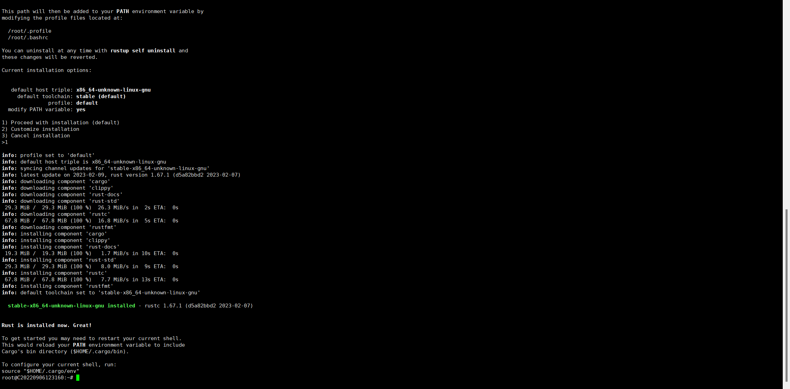
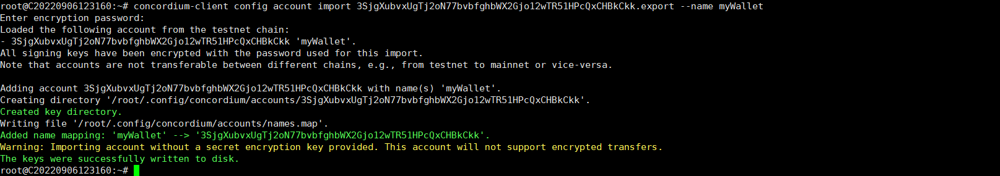

### 1. Install Rust

```
curl --proto '=https' --tlsv1.2 -sSf https://sh.rustup.rs | sh
```



### 2. Install cargo-concordium

##### 2.1 Install Wasm

```
rustup target add wasm32-unknown-unknown
```

##### 2.2 Install cargo-concordium

```
wget -O /root/.cargo/bin/cargo-concordium  https://distribution.concordium.software/tools/linux/cargo-concordium_2.7.0

chmod 755 /root/.cargo/bin/cargo-concordium
```


### 3. Install Concordium-client

```
wget -O /root/.cargo/bin/concordium-client https://distribution.concordium.software/tools/linux/concordium-client_5.0.2-

chmod 755 /root/.cargo/bin/concordium-client
```


### 4. Install the Web Wallet


### 5. Create a Testnet account


### 6. Acquiring testnet CCD via the CCD faucet


### 7. Export the account from web wallet and import it into concordium client

```
concordium-client config account import 3SjgXubvxUgTj2oN77bvbfghbWX2Gjo12wTR51HPcQxCHBkCkk.export --name myWallet
```

